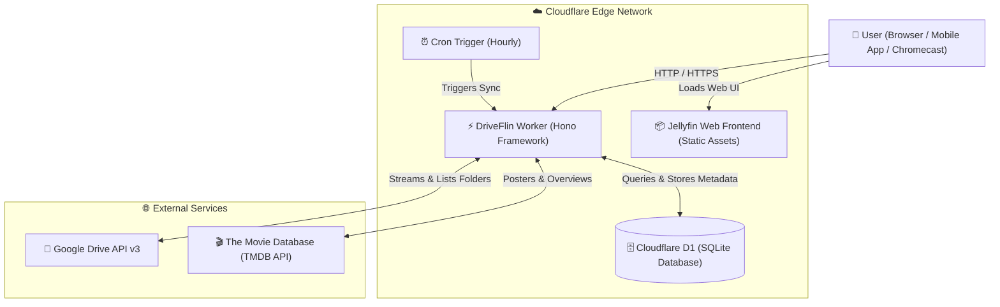

# 🎬 DriveFlin — Serverless Jellyfin on Cloudflare Workers & Google Drive

<p align="center">
  <a href="README.md"></a>
  <a href="README-en.md"></a>
</p>

<p align="center">
  <a href="README.md">🇧🇷 <strong>Português</strong></a> &nbsp;|&nbsp; 🇺🇸 <strong>English</strong>
</p>

<p align="center">
  
</p>

<p align="center">
  <strong>Transform your Google Drive into a high-performance, serverless personal streaming service with 100% Jellyfin client compatibility.</strong>
</p>

<p align="center">
  <a href="https://driveflin.org" target="_blank"></a>
  <a href="https://generator.driveflin.org" target="_blank"></a>
  <a href="#-repository-structure"></a>
  <a href="#-repository-structure"></a>
  <a href="#-repository-structure"></a>
</p>

<p align="center">
  <a href="https://driveflin.org" target="_blank"><strong>🌐 Official Website and Documentation: driveflin.org</strong></a>
</p>

---

## 📌 Overview

> 🌐 **Full Website & Documentation:** [https://driveflin.org](https://driveflin.org)  
> 🔑 **Automated Google Drive Connection Generator:** [https://generator.driveflin.org](https://generator.driveflin.org)  
> 📖 **Visual Deployment Guide:** [https://driveflin.org/deploy.php](https://driveflin.org/deploy.php)

**DriveFlin** is a complete, serverless reimplementation of the **Jellyfin** backend, engineered to run natively on **Cloudflare** global edge infrastructure (Workers + D1 SQL + Assets) streaming media directly from **Google Drive** (Personal or Shared/Team Drives).

With DriveFlin, you get all the features of the Jellyfin ecosystem — a modern Netflix-style dark web interface (JellyFlix), smart movie and TV show search, automated TMDB metadata, subtitle and dual audio track selection, Google Cast/Chromecast streaming, and full database backups — with **zero server hosting costs** and worldwide high availability.

---

## 📁 Repository Structure

The repository is structured cleanly, directly, and standardized for immediate deployment on Cloudflare Workers:

```text
DriveFlin/ (Repository Root)
├── src/
│   ├── index.ts          (Hono Worker: Jellyfin REST API routes & streaming engine)
│   ├── gdrive.ts         (Google Drive API v3 integration with full pagination)
│   ├── sync.ts           (Direct D1 library synchronization logic)
│   ├── tmdb.ts           (TMDB metadata search, synopses, posters & name cleaning)
│   ├── backup.ts         (Dual backup and restore routines: Google Drive + D1)
│   ├── inject.ts         (Web UI injection for Netflix dark theme & custom branding)
│   └── oauth_page.ts     (Built-in OAuth authentication & token exchange page)
├── public/               (Official Jellyfin Web client pre-configured for Workers)
├── wrangler.toml         (D1 database, Cron Triggers, and Worker config at root)
├── package.json          (Worker dependencies and scripts at root)
├── tsconfig.json         (TypeScript configuration for Workers)
├── schema.sql            (D1 database schema with default admin/admin account)
├── README.md             (Documentation and setup guide in Portuguese)
├── README-en.md          (Documentation and setup guide in English)
└── LICENSE               (MIT License)
```

---

## ✨ Key Features

- ⚡ **100% Serverless & Zero Hosting Cost**: No VPS, dedicated physical server, or 24/7 Docker container required. Runs within Cloudflare Workers' generous free tier.
- 📂 **Native Google Drive Integration**: High-speed direct streaming for `.mp4`, `.mkv`, `.avi`, `.mp3`, and `.flac` files.
- 🗂️ **Real-Time Folder Navigation**: When adding or editing a media library, browse your actual Google Drive folders visually right inside the Jellyfin dashboard.
- 🎬 **Automated Metadata & Posters via TMDB**: Automatic recognition of movie and TV show titles, overviews, release years, age ratings, and 1-click manual identification.
- 👥 **Automatic Version Grouping**: Multiple media files with the same title in a library are automatically merged into a single poster offering selectable *MediaSources*.
- 💾 **Dual Cloud Backup & 1-Click Restore**:
  - 1-click JSON snapshot exports of all tables (Libraries, Items, User Progress, Settings).
  - Dual persistence: automatically saved to the `DriveFlin_Backups` folder in Google Drive and Cloudflare D1.
  - Instant rollback and disaster recovery.
- 🎨 **Netflix Premium Interface (JellyFlix)**: Official Jellyfin Web client bundled with a cinematic dark theme, modern typography, and high-definition artwork.
- 📺 **Chromecast & Smart TV Streaming**: Fully compatible with the official Jellyfin Google Cast receiver app (`F007D354`), with native `206 Partial Content`, `Range` headers, and open CORS.
- 🔐 **Name Decryption with Rclone-Crypt**: Native support for encrypted or obfuscated media file and folder names on Google Drive.
- ⏰ **Automated Hourly Library Sync (Cron Trigger)**: Periodic background synchronization every hour (`0 * * * *`) to index newly uploaded media files.
- 🔑 **Built-In Google Drive Connection Generator**: Generate your secure Refresh Token in seconds without sharing credentials with third parties at [generator.driveflin.org](https://generator.driveflin.org).

---

## 🏗️ Architecture



---

## 🚀 Visual Cloudflare Setup & Deployment Guide (Recommended via Web)

Setup is 100% visual via your web browser, with no local CLI tools or command-line commands required.

### Step 1: Fork the Repository on GitHub
1. In the upper-right corner of this GitHub repository page, click **Fork**.
2. Select your personal GitHub account and click **Create fork**.
3. You now have an independent, personal copy of DriveFlin in your own GitHub account.

---

### Step 2: Create the D1 Database on Cloudflare (Takes 10 Seconds)
> [!NOTE]
> The D1 database is the serverless storage where DriveFlin keeps your media libraries, metadata, and watch progress. It should be created in your account prior to deployment so Cloudflare links it automatically by name.

1. Log in to the Cloudflare dashboard: [dash.cloudflare.com](https://dash.cloudflare.com).
2. In the left sidebar, navigate to **Storage & Databases** > **D1 SQL Database**.
3. Click **Create database**.
4. Under **Database name**, enter exactly: `jellyfin_db_prod`
5. Click **Create**. That's it!

> [!TIP]
> **100% Built-In Automatic Database Initialization:**  
> You do **NOT** need to open a SQL console, run terminal commands, or paste SQL scripts! DriveFlin automatically detects the new database and creates all tables, columns, indexes, and the default administrator account (`admin` / `admin`) on the very first time you open the site.

---

### Step 3: Connect Your Application to Cloudflare Workers & Pages
1. In the left sidebar, navigate to **Workers & Pages**.
2. Click the blue **Create application** button in the upper-right corner.
3. In the *"Make something new"* modal, select **Connect GitHub** (or *Import a repository*).
4. Under **Select a repository**:
   - Select your GitHub account.
   - Find and click on the **`DriveFlin`** repository (your fork).
   - Click **Next**.
5. On the **Set up your application** screen:
   - **Project name:** `driveflin` *(or your preferred name)*.
   - **Deploy command:** `npx wrangler deploy` *(pre-filled)*.
   - Click the blue **Deploy** button!
6. Cloudflare will start the build, detect the root `wrangler.toml`, and automatically link your `jellyfin_db_prod` database!

> [!NOTE]
> **Database binding error?**  
> If the deployment fails saying the database was not found, go to **Settings > Bindings > Add binding > D1 Database**, set variable name to `DB`, and select `jellyfin_db_prod`. Then click **Retry deployment**.

---

### Step 4: Add Media Variables and Secrets (Required)
Once the initial deployment completes, add your Google Drive and TMDB credentials:

1. In your Worker's dashboard (`driveflin`), navigate to **Settings** > **Variables and Secrets**.
2. Click **Add** and insert the following variables:

   | Variable / Secret | Type | Description |
   | :--- | :--- | :--- |
   | `TMDB_API_KEY` | Secret | 🔑 Free API Key from [TheMovieDB](https://www.themoviedb.org/settings/api). **Required for metadata and posters.** |
   | `GDRIVE_CLIENT_ID` | Secret | Client ID generated in the Google Cloud Console. |
   | `GDRIVE_CLIENT_SECRET` | Secret | Client Secret generated in the Google Cloud Console. |
   | `GDRIVE_REFRESH_TOKEN` | Secret | Refresh Token generated at [generator.driveflin.org](https://generator.driveflin.org). |
   | `ADMIN_PASSWORD` | Secret | *(Optional)* Admin password. If omitted, defaults to `admin`. |
   | `GDRIVE_TEAM_DRIVE_ID` | Secret | *(Optional)* Google Shared/Team Drive ID (leave blank if using personal My Drive). |
   | `RCLONE_PASS` | Secret | *(Optional)* Password if your Google Drive files use Rclone Crypt. |
   | `RCLONE_SALT` | Secret | *(Optional)* Salt if your Google Drive files use Rclone Crypt. |

3. Click **Save and Deploy** to apply the changes.

> [!TIP]
> **Get your free TMDB API Key:**  
> Go to [themoviedb.org/settings/api](https://www.themoviedb.org/settings/api), create a free account, and copy either the "API Read Access Token" or the "API Key (v3 auth)". DriveFlin uses it to automatically fetch posters, overviews, and metadata for all your movies and TV shows.

---

### Step 5: Access the Web Interface and Configure Your Libraries
1. Open your Worker's global public URL in your browser:  
   `https://driveflin.your-subdomain.workers.dev/web/index.html`
2. **Automatic Initial Login:**
   - **Username:** `admin`
   - **Password:** `admin`
3. Open the **Dashboard** (User avatar icon > Dashboard) > **Libraries**.
4. Click **+ Add Media Library**, select your content type (Movies, TV Shows, or Music), and pick your Google Drive folders directly through the visual folder browser!

---

## 💻 CLI Alternative: Deployment with Wrangler CLI

For developers who prefer managing everything locally via terminal:

```bash
# 1. Clone your repository
git clone https://github.com/samucamg/DriveFlin.git
cd DriveFlin

# 2. Install dependencies
npm install

# 3. Create Cloudflare D1 database
npx wrangler d1 create jellyfin_db_prod

# 4. Execute initial database schema
npx wrangler d1 execute jellyfin_db_prod --remote --file=schema.sql

# 5. Set secrets (including TMDB_API_KEY)
npx wrangler secret put TMDB_API_KEY
npx wrangler secret put GDRIVE_CLIENT_ID
npx wrangler secret put GDRIVE_CLIENT_SECRET
npx wrangler secret put GDRIVE_REFRESH_TOKEN

# 6. Deploy Worker
npx wrangler deploy
```

---

## 📖 Usage Guide & Daily Tips

1. **Factory Default Credentials**:
   - **Username**: `admin`
   - **Password**: `admin`
   - *We strongly recommend updating your password anytime in Dashboard > Users.*
2. **Identification & Posters (TMDB)**:
   - If an item does not load artwork automatically, click the three dots on the poster > **Identify**.
   - Type the movie or TV show title. DriveFlin will fetch and permanently persist high-resolution artwork and synopses.
3. **Generating & Restoring Backups**:
   - Go to **Dashboard** > **Backups**.
   - DriveFlin exports comprehensive `.json` snapshots saved both to Google Drive and Cloudflare D1 with 1-click restore.

---

## ⚖️ Project Purpose, Intended Use & Disclaimer

> [!IMPORTANT]
> **DriveFlin was engineered exclusively for personal use, private home media collections, and sharing among family and friends.**

- 🏠 **Personal Daily Focus**: DriveFlin's primary objective is to deliver a lightweight, zero-maintenance, and cost-free serverless streaming solution for everyday personal media consumption without keeping power-hungry PCs or servers running 24/7.
- 📚 **Massive Libraries (Thousands of Movies & TV Shows)**: For users managing massive catalogs (tens of thousands of titles and episodes), we strongly recommend using the **official [Jellyfin](https://jellyfin.org) desktop/server distribution (installed via Docker or Bare-Metal on dedicated PC/NAS)**. The official server offers multithreaded local database indexing and dedicated hardware video transcoding (GPU/FFmpeg).
- 🚫 **Not for Commercial Providers / Streaming Businesses**: DriveFlin is **NOT** designed, intended, or supported for internet providers, IPTV sellers, resellers, or commercial streaming distribution. For commercial or high-concurrency enterprise scenarios, we always and categorically recommend the official Jellyfin project infrastructure.
- ℹ️ **Trademark & Legal Notice**: DriveFlin is an independent open-source project compatible with the public API specifications of the Jellyfin and Google Drive ecosystems. It has NO affiliation, endorsement, sponsorship, or official connection with the Jellyfin Foundation or Google LLC.

---

## ⚠️ Important Constraints

- **Direct Play / Direct Stream Only**: Serverless edge environments (Cloudflare Workers / V8 Isolates) do not support binary executables like `ffmpeg` or dedicated GPUs. Therefore, **real-time server-side video transcoding is not supported**. Playback relies on the client device or web browser natively decoding the media formats (`H.264`, `AAC`, `MP3`, etc.).
- **C# (.NET) Plugins Not Supported**: Traditional Jellyfin plugins compiled as .NET DLLs are not supported, as DriveFlin's engine runs entirely on TypeScript/JavaScript inside V8 Isolates.

---

## 🔗 Useful Links & Official Documentation

- 🌐 **Website & Documentation:** [https://driveflin.org](https://driveflin.org)
- 🚀 **Illustrated Deployment Guide:** [https://driveflin.org/deploy.php](https://driveflin.org/deploy.php)
- 🔑 **Google Drive OAuth Connection Generator:** [https://generator.driveflin.org](https://generator.driveflin.org)
- 📂 **Library & Folder Organization Guide:** [https://driveflin.org/libraries.php](https://driveflin.org/libraries.php)
- ⚡ **Technical Differences & Serverless Architecture:** [https://driveflin.org/differences.php](https://driveflin.org/differences.php)
- ❓ **FAQ & Troubleshooting:** [https://driveflin.org/faq.php](https://driveflin.org/faq.php)
- 👥 **Community & Collaboration:** [https://driveflin.org/community.php](https://driveflin.org/community.php)

---

## 📄 License

Distributed under the MIT License. See [`LICENSE`](LICENSE) for details.

<p align="center">
  Developed with care for the open-source community. If this project helps you, please leave a ⭐ on GitHub!
</p>
