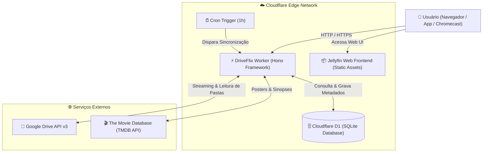

# 🎬 DriveFlix — Serverless Jellyfin on Cloudflare Workers & Google Drive

<p align="center">
  
</p>

<p align="center">
  <strong>Transform your Google Drive into a high-performance, serverless personal streaming service with 100% Jellyfin client compatibility.</strong>
</p>

<p align="center">
  <a href="#-recursos-principais"></a>
  <a href="#-arquitetura"></a>
  <a href="#-arquitetura"></a>
  <a href="#-arquitetura"></a>
</p>

---

## 📌 Visão Geral / Overview

**DriveFlix** é uma implementação completa e serverless do backend do **Jellyfin**, projetada para rodar nativamente sobre a infraestrutura global da **Cloudflare** (Workers + D1 SQL + Assets) consumindo arquivos de mídia diretamente do **Google Drive** (Pessoal ou Shared Drives/Team Drives).

Com o DriveFlix, você tem todos os recursos do Jellyfin — interface web moderna com tema Netflix (JellyFlix), busca inteligente de filmes e séries, metadados automáticos do TMDB, suporte a legendas e dual áudio, transmissão para Chromecast e recuperação de backups — com **custo zero de servidor** e alta disponibilidade mundial.

---

## ✨ Recursos Principais

- ⚡ **100% Serverless & Custo Zero**: Não requer VPS, servidor dedicado nem Docker ligado 24/7. Executa no plano gratuito do Cloudflare Workers.
- 📂 **Integração Nativa com Google Drive**: Streaming direto de arquivos `.mp4`, `.mkv`, `.avi`, `.mp3` e `.flac`.
- 🗂️ **Navegação de Pastas no Painel de Controle**: Ao criar ou editar uma biblioteca de mídia, navegue pelas pastas do Google Drive diretamente na janela do Jellyfin.
- 💾 **Sistema Completo de Backup & Restauração**:
  - Exportação em 1 clique de todas as tabelas (Bibliotecas, Itens, Progresso e Configurações).
  - Persistência dupla: salva os backups na pasta `DriveFlix_Backups` do seu Google Drive e na tabela interna do Cloudflare D1.
  - Restauração instantânea para fácil migração.
- 🎨 **Interface Netflix Premium (JellyFlix)**: Jellyfin Web oficial pré-configurado com tema escuro estilo Netflix, fontes modernas, cartazes em alta definição e logos originais.
- 📺 **Transmissão para Chromecast & Smart TVs**:
  - Compatibilidade com o aplicativo oficial do Jellyfin para Google Cast (`F007D354`).
  - Suporte total a requisições parciais HTTP (`206 Partial Content`), cabeçalhos `Range`, requisições `HEAD` e CORS liberado (`*`).
- 🎬 **Metadados & Capas via TMDB**: Identificação automática de títulos, sinopse, ano, classificação indicativa e busca de pôsteres remotos com 1 clique.
- 🔐 **Descriptografia de Nomes via Rclone-Crypt**: Suporte a nomes de arquivos ofuscados ou criptografados via Rclone no Google Drive.
- ⏰ **Tarefas Agendadas Automáticas (Cron Trigger)**: Sincronização periódica a cada hora (`0 * * * *`) para indexar novos arquivos adicionados ao Google Drive.
- 🎧 **Separação de Mídias Inteligente**: Carrosséis distintos de "Continuar assistindo" (para filmes e séries) e "Continuar Escutando" (para músicas).

---

## 🏗️ Arquitetura



---

## 📋 Pré-requisitos

1. **Conta na Cloudflare** (Gratuita).
2. **Conta no Google Cloud Platform** com a API do Google Drive ativada (Gratuita).
3. **Chave de API do TMDB** (The Movie Database - Gratuita).
4. **Node.js 18+** instalado localmente.

---

## 🚀 Guia de Instalação e Deploy

### 1. Clonar o Repositório
```bash
git clone https://github.com/samucamg/DriveFlix.git
cd DriveFlix
```

### 2. Instalar Dependências
```bash
npm install
```

### 3. Configurar o Banco de Dados Cloudflare D1
Crie a instância do banco D1 na sua conta Cloudflare:
```bash
cd backend
npx wrangler d1 create jellyfin_db_prod
```
O comando retornará o `database_id`. Atualize o arquivo `backend/wrangler.toml` com esse ID:
```toml
[[d1_databases]]
binding = "DB"
database_name = "jellyfin_db_prod"
database_id = "SEU_DATABASE_ID_AQUI"
```

Inicialize o esquema do banco de dados:
```bash
npx wrangler d1 execute jellyfin_db_prod --remote --file=schema.sql
```

### 4. Configurar as Credenciais e Segredos (Secrets)
Defina as variáveis de ambiente necessárias via Wrangler:

```bash
# Credenciais do Google Drive API (OAuth 2.0)
npx wrangler secret put GDRIVE_CLIENT_ID
npx wrangler secret put GDRIVE_CLIENT_SECRET
npx wrangler secret put GDRIVE_REFRESH_TOKEN

# Opcional: ID do Shared / Team Drive (deixe em branco se usar Drive pessoal)
npx wrangler secret put GDRIVE_TEAM_DRIVE_ID

# Chave do TMDB para pôsteres e metadados
npx wrangler secret put TMDB_API_KEY

# Opcional: Senha e Salt caso seus arquivos no Google Drive usem Rclone Crypt
npx wrangler secret put RCLONE_PASS
npx wrangler secret put RCLONE_SALT
```

### 5. Deploy no Cloudflare Workers
```bash
npx wrangler deploy
```
Pronto! Seu servidor Jellyfin estará online e acessível no endereço fornecido pela Cloudflare (ou no seu domínio personalizado associado).

---

## 📖 Como Usar

1. **Login Inicial**:
   - **Usuário**: `admin`
   - **Senha**: `Filmes@2026` *(Recomendamos alterar nas configurações de usuário do painel)*.
2. **Adicionar Novas Bibliotecas**:
   - Acesse **Painel de Controle** -> **Bibliotecas**.
   - Clique em **+ Adicionar Biblioteca de Mídia**.
   - Escolha o tipo de conteúdo (Filmes, Séries, Música).
   - Ao adicionar uma pasta, use o seletor visual do Google Drive ou insira diretamente o ID da pasta do Google Drive.
   - O DriveFlix iniciará a sincronização e o enriquecimento de metadados automaticamente em segundo plano.
3. **Criar e Restaurar Backups**:
   - Acesse **Painel de Controle** -> **Backups**.
   - Clique em **Criar backup** para gerar um arquivo `.json` completo salvo no seu Google Drive (`DriveFlix_Backups`) e no Cloudflare D1.
   - Clique no botão de restauração em qualquer backup da lista para recuperar instantaneamente seu servidor.

---

## ⚠️ Limitações Importantes

- **Apenas Direct Play / Direct Stream**: O ambiente serverless de borda (Cloudflare Workers / V8 Isolates) não possui suporte a execução de binários locais como `ffmpeg` nem placas de vídeo dedicadas. Portanto, **não há transcodificação de vídeo em tempo real**. A reprodução depende da capacidade do navegador ou dispositivo do usuário decodificar diretamente os formatos de mídia (`H.264`, `AAC`, `MP3`, etc.).
- **Plugins Jellyfin em C# (.NET)**: Plugins tradicionais compilados em DLLs .NET não são suportados, pois o backend roda inteiramente em TypeScript/JavaScript na V8.

---

## 📄 Licença

Distribuído sob a licença MIT. Consulte `LICENSE` para mais detalhes.

---

<p align="center">
  Desenvolvido com carinho para a comunidade open-source. Se este projeto foi útil para você, deixe uma ⭐ no repositório!
</p>
