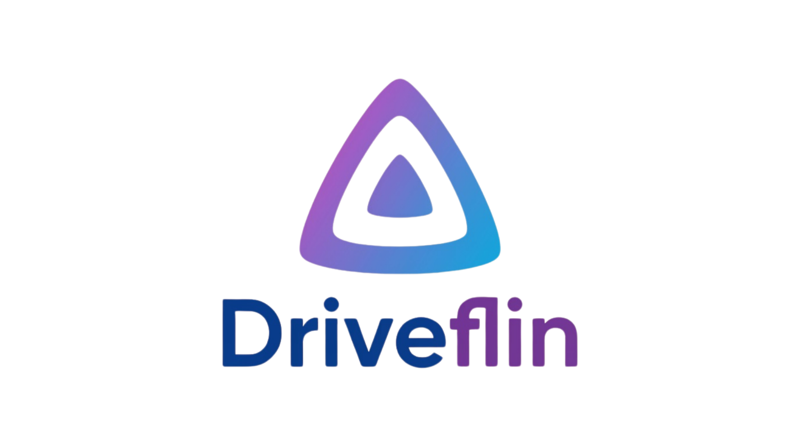
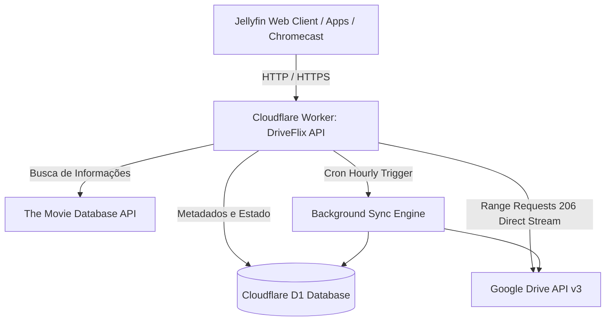

<p align="center">
  
</p>

<h1 align="center">DriveFlix</h1>

<p align="center">
  <strong>Serverless Jellyfin Backend Powered by Google Drive & Cloudflare Workers</strong>
</p>

<p align="center">
  <a href="#features">Recursos</a> •
  <a href="#architecture">Arquitetura</a> •
  <a href="#limitations">Limitações</a> •
  <a href="#deployment">Guia de Instalação</a> •
  <a href="#backup">Backups</a> •
  <a href="#license">Licença</a>
</p>

---

## 🌟 O que é o DriveFlix?

O **DriveFlix** é uma implementação **100% Serverless** do backend do **Jellyfin**, projetada para rodar inteiramente no **Cloudflare Workers** com persistência no **Cloudflare D1** (SQLite distribuído) e armazenamento de mídia no **Google Drive**.

Ele elimina a necessidade de manter servidores dedicados, computadores ligados 24 horas por dia ou VPS pagas. Você obtém uma experiência completa de streaming estilo **Netflix**, com metadados do TMDB, capas em alta definição, suporte a dual áudio e legendas, direto do seu Google Drive e com **custo zero de hospedagem**.

---

## ✨ Recursos

- ⚡ **100% Serverless:** Hospedado no Cloudflare Workers (plano gratuito generoso, latência global mínima).
- 📁 **Google Drive como Armazenamento:** Seus filmes, séries e músicas ficam salvos no Google Drive (pessoal ou Workspace).
- 🎬 **Tema Netflix Moderno:** Interface personalizada com JellyFlix pré-injetado, visual vermelho Netflix, cartões animados e layout fluido.
- 🍿 **Metadados Automáticos (TMDB):** Busca títulos, sinopses, anos de lançamento, avaliações, pôsteres e backdrops automaticamente via TheMovieDb API.
- 🔐 **Descriptografia Rclone Transparente:** Suporte nativo ao formato de criptografia do Rclone Crypt (`base32`), decodificando nomes de arquivos em tempo de execução.
- 📡 **Google Cast & Chromecast:** Configurado com o App ID oficial do Jellyfin (`F007D354`) para transmissão direta para TVs e dispositivos Chromecast.
- 🔄 **Tarefas Agendadas (Cron Triggers):** Varredura e sincronização automática das bibliotecas a cada hora em segundo plano.
- 💾 **Sistema de Backup Integrado:** Criação e restauração de cópias de segurança do banco de dados direto pelo painel web (`#/dashboard/backups`), com persistência tanto no Google Drive quanto no Cloudflare D1.
- 🗂️ **Gerenciador de Bibliotecas Inteligente:** Adição e remoção de bibliotecas diretamente pela interface web informando o ID da pasta do Google Drive ou navegando pelas pastas.
- ⏯️ **Continuar Assistindo:** Histórico de reprodução e barra de progresso sincronizados com distinção entre vídeos e músicas.

---

## 🏗️ Arquitetura



---

## ⚠️ Limitações e Escolhas de Design (Direct Play Only)

Por ser uma aplicação serverless executada em ambientes V8 isolados no edge da Cloudflare, o DriveFlix adota o modelo **Direct Play / Direct Stream**:

1. **Sem Transcodificação em Tempo Real com FFmpeg:** O Cloudflare Workers possui limite de CPU por requisição e não suporta a execução de binários como o `ffmpeg`. Todo o conteúdo é transmitido diretamente em seu formato original.
2. **Formatos Recomendados:** Para compatibilidade nativa com navegadores, Smart TVs e Chromecast, utilize:
   - **Vídeo:** MP4 ou MKV com codec H.264 (AVC) ou H.265 (HEVC em clientes compatíveis).
   - **Áudio:** AAC ou MP3.
   - **Legendas:** WebVTT ou SRT (externas ou convertidas em tempo de execução).

---

## 🚀 Estratégia e Guia de Deploy

A forma recomendada para utilizar o **DriveFlix** é através do **Fork no GitHub**. Dessa forma, seu projeto permanece conectado ao repositório oficial e você recebe todas as atualizações com apenas um clique em **"Sync Fork"**.

### Método Recomendado: Fork + GitHub Actions

#### 1. Faça o Fork do Repositório
Clique no botão **Fork** no topo desta página (`https://github.com/samucamg/DriveFlix`) para criar uma cópia em sua conta do GitHub.

#### 2. Crie as Credenciais do Google Cloud Console
1. Acesse o [Google Cloud Console](https://console.cloud.google.com/).
2. Crie um projeto e ative a **Google Drive API**.
3. Na tela de consentimento OAuth, defina como **Externo** e adicione seu e-mail como usuário de teste.
4. Crie credenciais do tipo **ID do cliente OAuth** (Tipo: Aplicativo Web ou Desktop).
5. Gere o `refresh_token` com permissão de acesso ao Google Drive (escopo `https://www.googleapis.com/auth/drive`).

#### 3. Obtenha a Chave da API do TMDB
1. Crie uma conta gratuita em [themoviedb.org](https://www.themoviedb.org/).
2. Vá em **Configurações > API** e gere uma chave de API v3.

#### 4. Configure o Cloudflare D1 e os Segredos
No terminal da sua máquina (ou via GitHub Codespaces):

```bash
# Clone seu fork
git clone https://github.com/SEU_USUARIO/DriveFlix.git
cd DriveFlix

# Instale as dependências
npm install

# Crie seu banco de dados no Cloudflare D1
npx wrangler d1 create driveflix_db

# Inicialize as tabelas
npx wrangler d1 execute driveflix_db --remote --file=schema.sql
```

Adicione o `database_id` gerado no seu arquivo `wrangler.toml`:

```toml
[[d1_databases]]
binding = "DB"
database_name = "driveflix_db"
database_id = "SEU_DATABASE_ID_AQUI"
```

Configure os segredos na Cloudflare:

```bash
npx wrangler secret put GDRIVE_CLIENT_ID
npx wrangler secret put GDRIVE_CLIENT_SECRET
npx wrangler secret put GDRIVE_REFRESH_TOKEN
npx wrangler secret put TMDB_API_KEY

# Opcional (se usar nomes criptografados com rclone):
npx wrangler secret put RCLONE_PASS
npx wrangler secret put RCLONE_SALT
```

#### 5. Realize o Deploy
```bash
npx wrangler deploy
```

Pronto! Acesse a URL gerada pelo Cloudflare Workers (ou vincule seu domínio personalizado em **Workers & Pages > Settings > Domains**).

---

## 📦 Como Fazer Backup e Restauração

O DriveFlix possui suporte nativo à cópia de segurança pelo painel do Jellyfin:

1. Acesse **Administração > Backups** (`#/dashboard/backups`).
2. Clique em **Criar backup**. O sistema exportará todas as bibliotecas, metadados e histórico de reprodução em um arquivo JSON e salvará automaticamente:
   - Na pasta `DriveFlix_Backups` do seu Google Drive.
   - Na tabela de segurança local do Cloudflare D1.
3. Para restaurar, basta clicar no ícone de **Restaurar** ao lado do backup desejado.

---

## 📄 Licença

Este projeto é distribuído sob a licença MIT. Consulte o arquivo [LICENSE](LICENSE) para obter mais informações.

<p align="center">
  Desenvolvido com carinho para a comunidade open-source.
</p>
